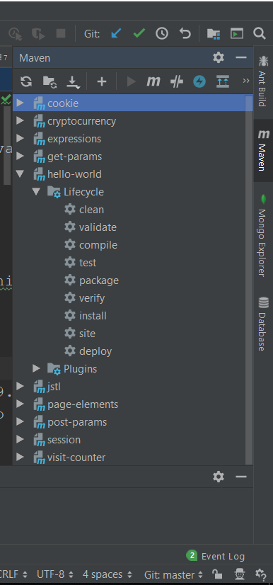
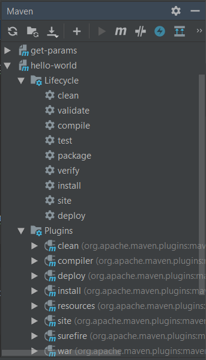

# hello-world

[:bulb: This file is translated version of original file available here](README.md)

Najprostsza wersja servletu mavenowego

## Jak to uruchomić?

1. Skompiluj źródła do pliku *war* poniższym poleceniem
```
mvn clean package
```

:bulb: Możesz śmiało użyć swojego IDE w tym celu.



2. Skopiuj `hello-world.war` (po poprawnej komplikacji będzie znajdował się w folderze `target`) do `TOMCAT\apache-tomcat-9.0.8\webapps\`
3. Zakładając, że twój serwer tomcat jest uruchomiony, przejdź do `http://localhost:8080/hello-world` używając swojej przeglądarki w tym celu.

## Automatyzacja procesu wdrażania przy użyciu pluginu mavenowego
Zamiast każdorazowo ręcznego kopiowania pliku .war, możemy zautomatyzować cały ten proces, przy użyciu pluginu tomcat7
1. Dodaj poniższy plugin do swojej konfiguracji mavena w `pom.xml` w sekcji build
```
  <plugins>
      <plugin>
        <groupId>org.apache.tomcat.maven</groupId>
        <artifactId>tomcat7-maven-plugin</artifactId>
        <version>2.2</version>
        <configuration>
          <url>http://localhost:8080/manager/text</url>
          <server>TomcatServer</server>
          <username>tomcat</username>
          <password>tomcat</password>
        </configuration>
      </plugin>
    </plugins>
```

2. Dodaj definicję serwera w pliku `~/.m2/setting.xml`
```
<servers>  
    <server>
       <id>TOMCAT8</id>
       <username>tomcat</username>
       <password>tomcat</password>
    </server>
</servers> 
```
3. Na koniec dodaj następującą rolę do pliku `TOMCAT_HOME/conf/tomcat-users.xml`
```
  <role rolename="tomcat"/>
  <role rolename="role1"/>
  <role rolename="manager-gui"/>
  <user username="tomcat" password="tomcat" roles="tomcat,manager-gui"/>
  <user username="both" password="both" roles="tomcat,role1"/>
  <user username="role1" password="role1" roles="role1"/>
```
4. Aby zbudować i wdrożyć kod swojej aplikacji na serwer wystarczy wykonać następujące polecenie
```
mvn clean install && mvn tomcat:deploy
```
lub jeśli chcesz zrobić to ponownie
```
mvn clean install && mvn tomcat:redeploy
```
:bulb: Jeżeli nie jesteś fanem konsoli, możesz osiągnąć dokładnie to samo z poziomu swojego IDE



## Zadanie

Zmień domyślne zachowanie tego servletu i zmuś go do wyświetlenia na stronie następującego komunikatu
```
Hello Software Development Academy!
```
